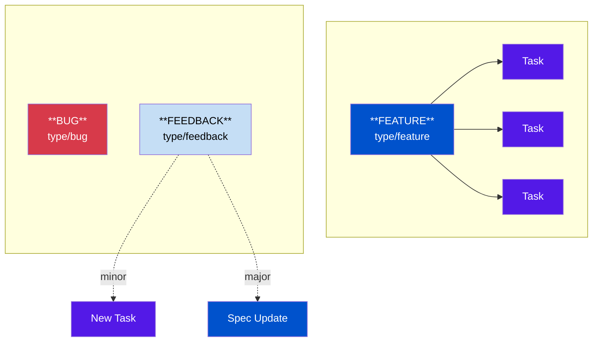
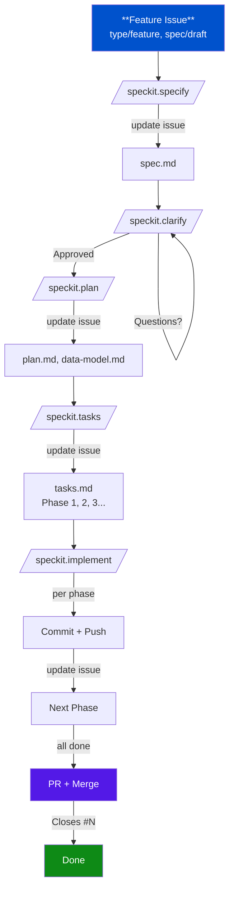
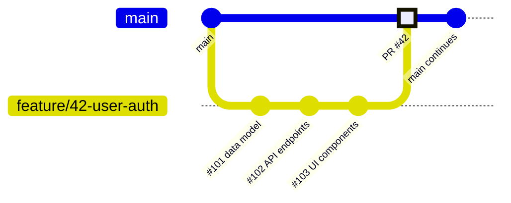

# gh-sdd-ai-workflow

**Centralized methodology for Spec-Driven Development with AI agents and GitHub Issues.**

## Repository Structure

```
├── README.md                    ← Methodology documentation (this file)
├── CLAUDE.md                    ← Instructions for this repo
├── BOOTSTRAP.md                 ← Checklist for new projects
├── skills/                      ← Claude Code skills
│   ├── start-work/SKILL.md      ← Start work on issue
│   ├── progress/SKILL.md        ← Add progress comment
│   ├── done/SKILL.md            ← Complete issue
│   ├── feedback/SKILL.md        ← Process feedback
│   └── feature-spec/SKILL.md    ← Bridge Feature→Spec-Kit
└── templates/
    └── .github/ISSUE_TEMPLATE/
        ├── feature.md           ← Feature with spec
        ├── bug.md               ← Bug report
        └── feedback.md          ← Feedback on feature
```

## About This Repository

This is a **methodology repository**, not a runtime dependency. Individual projects:
- Initialize Spec-Kit locally (`specify init`)
- Copy issue templates from `templates/`
- Reference this methodology in their CLAUDE.md
- Remain fully functional standalone

**Key principle:** Projects are self-contained. This repo provides templates, documentation, and optional shared skills - but each project works independently.

> **Language note:** Documentation is in English. Users can communicate with Claude in Czech or English.

---

# Methodology Documentation

## Goal

Replace MD-based workflow (PLAN.md + DEVLOG.md) with GitHub Issues integrated with [GitHub Spec-Kit](https://github.com/github/spec-kit) for spec-driven development.

---

## Issue Structure

Simplified two-level hierarchy + supporting types:



| Type | Label | Has Spec | Description |
|------|-------|----------|-------------|
| Feature | `type/feature` | Yes (`specs/###-name/`) | Main work unit, tracked in GitHub |
| Task | `type/task` | No | Optional - tasks live in `tasks.md`, issues are optional |
| Bug | `type/bug` | No | Standalone fix |
| Feedback | `type/feedback` | No | Routes to spec update or bug |

**Key points:**
- **Feature** is the main tracking unit in GitHub Issues
- **Tasks** are defined in `tasks.md` and implemented via `/speckit.implement`
- Task issues are **optional** - create them only if you need GitHub-level tracking
- User Stories are part of `spec.md`, tagged `[US1]`, `[US2]` in tasks

---

## Labels

> **TODO:** Migrate to native [GitHub Issue Types](https://docs.github.com/en/issues/tracking-your-work-with-issues/using-issues/managing-issue-types-in-an-organization) when `gh` CLI fully supports them. Native types (Task, Bug, Feature) are available at org level but CLI tooling is limited.

```bash
# Issue types
gh label create "type/feature" -c "0052CC" -d "Feature with spec (triggers Spec-Kit)"
gh label create "type/task" -c "5319E7" -d "Implementation task (generated from spec)"
gh label create "type/bug" -c "D73A4A" -d "Bug fix (no spec needed)"
gh label create "type/feedback" -c "C5DEF5" -d "Feedback to process"

# Spec workflow
gh label create "spec/draft" -c "FEF2C0" -d "Spec in progress"
gh label create "spec/approved" -c "0E8A16" -d "Spec approved, ready for tasks"

# Status
gh label create "status/wip" -c "FBCA04" -d "Work in progress"
gh label create "status/blocked" -c "D93F0B" -d "Blocked"

# Priority (optional)
gh label create "priority/high" -c "B60205" -d "High priority"
```

---

## Milestones

Create **ad-hoc** when it makes sense (release, important milestone, MVP done).

```bash
# Example - only when needed
gh api repos/{owner}/{repo}/milestones -f title="v0.1-mvp" -f description="Minimum viable product"
```

---

## Spec-Driven Development (SDD)

### Why SDD

- AI agents need **unambiguous instructions** for autonomous work
- Spec as "shared source of truth" between you and AI
- You invest time in spec → AI invests time in implementation
- Measurable criteria = validatable results

### Tool: GitHub Spec-Kit

[Spec-Kit](https://github.com/github/spec-kit) is the official GitHub toolkit for SDD. It supports Claude Code and other AI agents.

**Installation:**
```bash
# Requires uv (Python package manager)
uv tool install specify-cli --from git+https://github.com/github/spec-kit.git

# Initialize for Claude Code
specify init . --here --ai claude
```

**Commands:**
| Command | Function |
|---------|----------|
| `/speckit.specify` | Creates spec from feature description |
| `/speckit.clarify` | Detects ambiguity, asks questions (max 5) |
| `/speckit.plan` | Technical plan from spec |
| `/speckit.tasks` | Generates tasks.md with phases |
| `/speckit.implement` | Implements tasks from tasks.md |
| `/speckit.taskstoissues` | *(Optional)* Creates GitHub Issues from tasks |

### Connecting Spec-Kit with Feature Issues

Spec-Kit commands work with local files (`specs/###-feature-name/`) and don't automatically read GitHub Issues. **Manual bridging is required.**

**Recommended workflow:**

```
1. Create Feature issue manually (high-level description)

2. Read the issue and pass content to Spec-Kit:
   "Read Feature issue #123 and run /speckit.specify with its content"

   Claude will:
   - gh issue view 123 --json title,body
   - Extract description
   - Run /speckit.specify "[extracted content]"

3. After spec is created, update the Feature issue:
   - Add comment with link to spec.md
   - Update checklist in issue body

4. Continue with /speckit.clarify, /speckit.plan, etc.
```

**Automation:** Use `/feature-spec` skill from `skills/feature-spec/` to automate this bridging.

### Workflow: Feature → Spec → Implementation



**Steps:**
1. **Feature Issue** - Create with high-level description, add branch link
2. **/speckit.specify** - Creates `specs/###-name/spec.md` → **update issue**
3. **/speckit.clarify** - AI asks questions, refine until approved → **update issue**
4. **/speckit.plan** - Creates `plan.md`, `data-model.md`, `contracts/` → **update issue**
5. **/speckit.tasks** - Generates `tasks.md` with phases → **update issue**
6. **Implement** - Run `/speckit.implement` per phase, commit + push after each
7. **PR** - Create PR with `Closes #Feature`

> **IMPORTANT:** After each Spec-Kit command, update the Feature issue with links to created documents and current status. This ensures visibility and traceability.

---

## Issue Templates

Issue templates are in `templates/.github/ISSUE_TEMPLATE/`:

| Template | Purpose |
|----------|---------|
| `feature.md` | New feature with spec workflow checklist |
| `bug.md` | Bug report (observed/expected/repro) |
| `feedback.md` | Feedback on existing feature |

Copy to your project:
```bash
cp -r templates/.github .
```

---

## Processing Feedback Issues

Feedback can range from minor tweaks to spec changes. Use `/feedback` skill to classify:

| Classification | Action |
|----------------|--------|
| **A) MINOR** | Create task, implement directly |
| **B) SPEC UPDATE** | Update spec.md, regenerate tasks |
| **C) STANDALONE** | Create new Feature or handle as bug |

See `skills/feedback/SKILL.md` for full workflow.

---

## Iterative Workflow

### Daily Work

```bash
# 1. What's in progress?
gh issue list -l "status/wip"

# 2. Pick a task
gh issue edit <num> --add-label "status/wip"

# 3. Work (70% context blocks)

# 4. Commit with reference
git commit -m "feat: implement X

Closes #123"

# 5. Progress comment (for longer tasks)
gh issue comment <num> -b "Progress: done X, next Y"
```

### Closing Keywords

In commit message, automatically close issues:
- `Closes #123`, `Fixes #123`, `Resolves #123`

### Progress Comment Template

```markdown
## Progress: 2026-01-27

### Done
- [x] Implemented X
- [x] Added tests for Y

### Next
- [ ] Still need Z

### Notes
- Discovered issue with W, created #456
```

---

## Branching Strategy

Feature-based branching: one branch per Feature, Tasks are commits within.



### Rules

| Rule | Description |
|------|-------------|
| **Branch per Feature** | `feature/{issue-number}-{short-name}` |
| **Link branch to issue** | Add comment with branch link for easy file navigation |
| **Commit per phase** | Commit and push after each implementation phase |
| **Update issue** | Update Feature issue after each phase with progress |
| **PR at the end** | Create PR when all phases are done |
| **Squash merge** | Keep main history clean |
| **Close via PR** | PR description: `Closes #N` for Feature issue |

### Workflow

```bash
# 1. Start Feature - create branch
git checkout -b feature/42-user-auth

# 2. Link branch to issue
gh issue comment 42 -b "**Branch:** [feature/42-user-auth](../../tree/feature/42-user-auth)"

# 3. Run spec phases (specify, clarify, plan, tasks)
# Update issue after each phase!

# 4. Implement per phase
# "/speckit.implement Phase 1 from Feature #42"
git add . && git commit -m "feat: Phase 1 - setup infrastructure" && git push

# 5. Update issue with progress
gh issue comment 42 -b "Phase 1 complete. Commits: abc123"

# 6. Repeat for each phase...

# 7. Create PR when all phases done
gh pr create --title "feat: User authentication" --body "## Summary
Complete implementation of user authentication.

Closes #42"

# 8. Squash merge
gh pr merge --squash
```

### Exceptions

- **Bug fixes:** Direct branch `fix/{issue-number}-{description}`, PR to main
- **Hotfixes:** Can go directly to main if urgent (solo projects)
- **Small standalone tasks:** `task/{issue-number}` branch, PR to main

---

## Skills

Skills are in `skills/` folder. Copy to your project's `.claude/skills/` or use globally via `~/.claude/skills/`.

| Skill | Purpose |
|-------|---------|
| `/start-work` | Start working on issue (branch, WIP label, comment) |
| `/progress` | Add progress comment to issue |
| `/done` | Complete issue (commit, remove WIP, comment) |
| `/feedback` | Analyze and route feedback |
| `/feature-spec` | Bridge Feature issue → Spec-Kit |

---

## Recommended Prompts

### Spec Phases

```bash
# Start new feature (reads issue, creates spec)
"Read Feature issue #N and run /speckit.specify with its content"

# Clarify spec
"/speckit.clarify"

# Create technical plan
"/speckit.plan"

# Generate tasks
"/speckit.tasks"
```

### Implementation (Iterative)

**Recommended approach** - run one phase at a time with explicit commit/push:

```bash
# Implement next incomplete phase
"/speckit.implement next incomplete phase from Feature #N. After completion: commit, push, update Feature issue with progress."

# Or shorter version (requires CLAUDE.md setup)
"/speckit.implement Phase X from Feature #N"
```

### Progress Updates

```bash
# Update Feature issue with current state
"Update Feature issue #N with current implementation progress and links to artifacts"

# Add branch link to issue (at start of work)
"Add comment to Feature issue #N with link to branch for easy file navigation"
```

### Feature Completion

```bash
# Create PR and close feature
"Create PR for Feature #N with summary of all changes. Include 'Closes #N' in PR body."
```

---

## Feature Issue Updates (REQUIRED)

After **every** Spec-Kit command, update the Feature issue with:

1. **Link to created document** (in branch)
2. **Current workflow status**
3. **Next step**

### Example Comment Template

```markdown
## Spec Phase Complete ✓

**Branch:** [feature/N-name](../../tree/feature/N-name)

### Created
- [spec.md](../../blob/feature/N-name/specs/001-name/spec.md)

### Status
- [x] /speckit.specify
- [ ] /speckit.clarify
- [ ] /speckit.plan
- [ ] /speckit.tasks
- [ ] Implementation

### Next
Run `/speckit.clarify` to refine the spec.
```

### After Implementation Phase

```markdown
## Phase X Complete ✓

### Implemented
- [x] T001-T005 (Setup)
- [x] T006-T008 (Foundation)

### Commits
- `abc123` feat: add monorepo structure
- `def456` feat: add shared package

### Next
Phase 3: User Story 1 (T009-T020)
```

---

## Project Organization

```
┌─────────────────────────────────────────────────────────────────┐
│  gh-sdd-ai-workflow (this repo)                                 │
│  ─────────────────────────────                                  │
│  • Methodology documentation                                    │
│  • Custom skills (beyond Spec-Kit)                             │
│  • Issue templates (source of truth)                           │
│  • Bootstrap instructions                                       │
│  • NOT a runtime dependency                                    │
└─────────────────────────────────────────────────────────────────┘
                              ↓
              Bootstrap new project (one-time)
                              ↓
┌─────────────────────────────────────────────────────────────────┐
│  Individual Project                                             │
│  ──────────────────                                             │
│  • Spec-Kit initialized locally (specify init)                 │
│  • Issue templates copied from methodology                     │
│  • CLAUDE.md references methodology doc                        │
│  • Fully self-contained and standalone                         │
│  • Works for anyone who clones just this repo                  │
└─────────────────────────────────────────────────────────────────┘
```

**Why this approach:**
1. **Projects are portable** - Anyone can clone a single project and it works
2. **Methodology evolves** - Update here, projects can pull changes
3. **Spec-Kit stays local** - Each project has its own `/speckit.*` commands
4. **Skills can be shared** - Via `~/.claude/skills/` or symlinks (optional)

---

## Bootstrap New Project

See **[BOOTSTRAP.md](BOOTSTRAP.md)** for complete checklist.

Quick steps:
1. Create project folder and GitHub repo
2. `specify init . --here --ai claude`
3. Create labels (see Labels section)
4. `cp -r /path/to/gh-sdd-ai-workflow/templates/.github .`
5. Create CLAUDE.md with workflow reference
6. Commit and push

---

## gh CLI Quick Reference

```bash
# Issues
gh issue list                           # List
gh issue list -l "type/feature"         # Filter
gh issue view 123                       # Detail
gh issue create -t "Title" -b "Body" -l "type/feature"
gh issue edit 123 --add-label "x"
gh issue comment 123 -b "Text"
gh issue close 123

# Labels
gh label list
gh label create "name" -c "color" -d "description"
```

---

## Resources

- [GitHub Spec-Kit](https://github.com/github/spec-kit) - Official SDD toolkit
- [Spec-driven development blog](https://github.blog/ai-and-ml/generative-ai/spec-driven-development-with-ai-get-started-with-a-new-open-source-toolkit/)
- [GitHub Sub-issues](https://github.blog/engineering/architecture-optimization/introducing-sub-issues-enhancing-issue-management-on-github/)
- [Claude Code Skills Docs](https://code.claude.com/docs/en/skills)
- [gh CLI Manual](https://cli.github.com/manual/)
